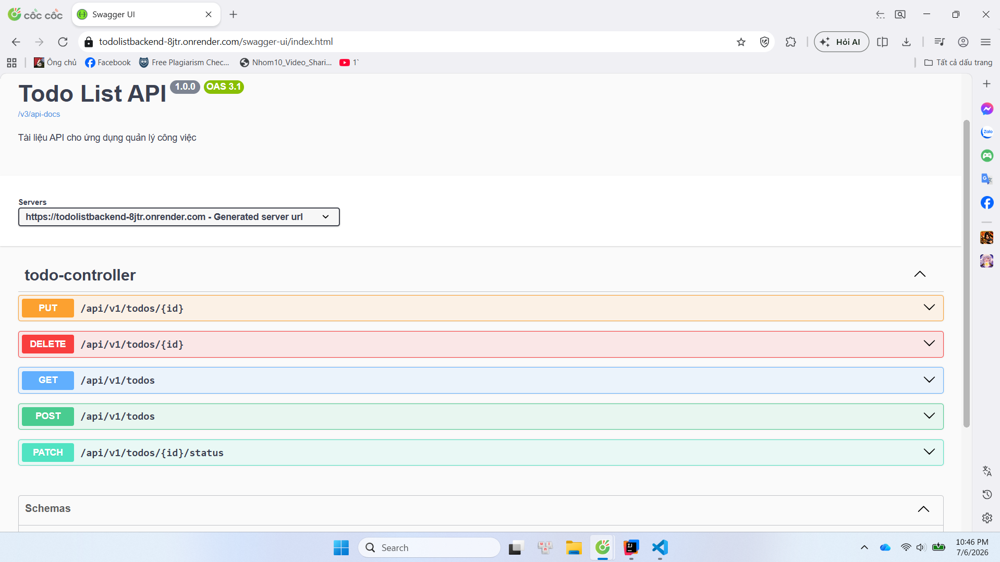

# TodoList Application - Backend

Hệ thống Backend cung cấp các RESTful API phục vụ cho ứng dụng quản lý công việc (TodoList). Dự án được xây dựng bằng Java Spring Boot, sử dụng cơ sở dữ liệu PostgreSQL và được đóng gói bằng Docker để triển khai lên Render.

## 🚀 Live Demo & API Testing

- **Backend API URL:** [https://todolistbackend-8jtr.onrender.com/api/v1/todos](https://todolistbackend-8jtr.onrender.com/api/v1/todos)
- **Swagger UI:** [https://todolistbackend-8jtr.onrender.com/swagger-ui/index.html](https://todolistbackend-8jtr.onrender.com/swagger-ui/index.html)
- 
  *(Sử dụng giao diện Swagger UI để xem tài liệu chi tiết và test trực tiếp các endpoint API ngay trên trình duyệt mà không cần dùng phần mềm bên thứ ba).*

## 🛠️ Công nghệ sử dụng

- **Ngôn ngữ:** Java 21
- **Framework:** Spring Boot (v4.x)
- **Data Access:** Spring Data JPA
- **Cơ sở dữ liệu:** PostgreSQL
- **Tài liệu API:** OpenAPI 3 / Swagger
- **Đóng gói & Triển khai:** Docker, Render Cloud

## 📋 Tính năng chính

- Cung cấp RESTful API cho các thao tác CRUD (Tạo, Đọc, Cập nhật, Xóa) công việc.
- Hỗ trợ lọc công việc theo trạng thái (Đang làm / Hoàn thành) và tìm kiếm theo từ khóa.
- Tích hợp cấu hình CORS cho phép Frontend kết nối an toàn.
- Tự động đồng bộ hóa cấu trúc bảng dữ liệu (DDL Auto Update).

## ⚙️ Cấu hình môi trường (Environment Variables)

Khi triển khai hoặc chạy dưới local, ứng dụng yêu cầu các biến môi trường sau:
- `DATABASE_URL`: Chuỗi kết nối đến PostgreSQL tuân theo định dạng chuẩn JDBC:
  `jdbc:postgresql://<host>:<port>/<dbname>?user=<username>&password=<password>`

## 💻 Hướng dẫn chạy local

### Yêu cầu hệ thống
- Máy tính đã cài đặt Java 21 (JDK 21).
- PostgreSQL chạy local (hoặc sử dụng database online).
- Maven (nếu muốn chạy trực tiếp bằng Maven gốc).

### Các bước thực hiện

1. **Clone repository về máy:**
   ```bash
   git clone https://github.com/datt152/TodoListBackend.git
   cd TodoListBackend
   ```

2. **Cấu hình Database:**
   Mở file `src/main/resources/application.properties` và cấu hình chuỗi kết nối Database tương ứng.

3. **Khởi chạy ứng dụng (Chọn 1 trong 3 cách sau):**

   *Cách 1: Chạy trực tiếp bằng Maven (Khuyên dùng nếu đã cài Maven)*
   ```bash
   mvn spring-boot:run
   ```
   *Cách 2: Chạy bằng Maven Wrapper (Nếu chưa cài Maven vào máy)*
   ```bash
   ./mvnw spring-boot:run
   ```

4. **Truy cập tài liệu API:**
   Mở trình duyệt và truy cập `http://localhost:8080/swagger-ui/index.html`